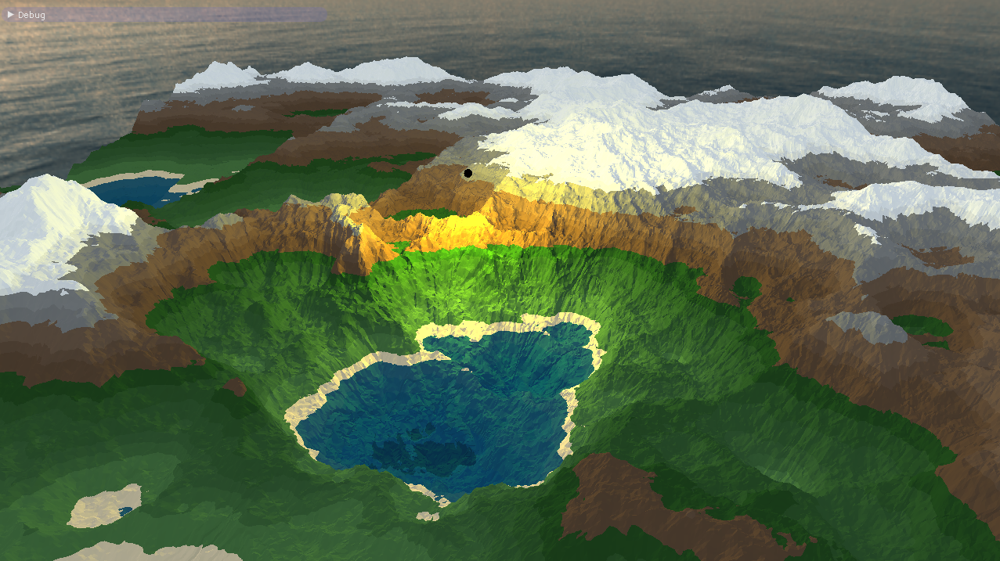

# OwO

Open World generation I guess, well not really for now but you get the idea

 

# Credits

* [**Chalmers CSE**](https://www.cse.chalmers.se/edu/course/TDA362/) : Code boilerplate
* [**Heargo**](https://github.com/Heargo/) : Color palette
